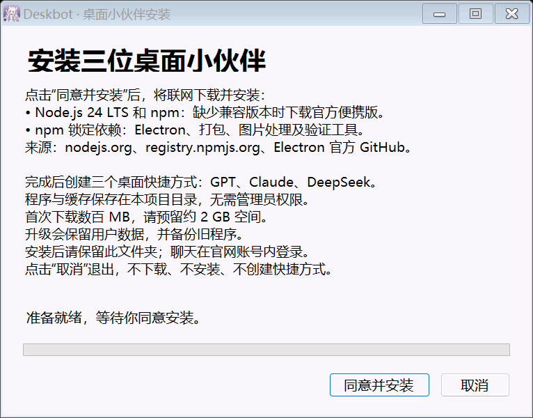

# Windows 安装说明

## 克隆并安装

1. 在 Windows 10 / 11 x64 安装 Git，克隆本仓库到普通用户可写目录。
2. 双击项目根目录的 `install.exe`。
3. 阅读下载和安装说明，点击“同意并安装”；点击“取消”会直接退出，不下载或写入安装文件。
4. 等待进度达到 100%。桌面会出现 GPT、Claude、DeepSeek 三个快捷方式，分别启动对应角色。

首次安装需要网络，下载量为数百 MB，建议预留约 2 GB 磁盘空间。安装期间可查看进度；失败后点击“查看日志”，解决网络或目录权限问题后重新运行安装器。



## 安装器会做什么

| 内容 | 来源与用途 |
| --- | --- |
| Node.js 24 LTS 与 npm | 若系统没有兼容的 Node.js，则从 [Node.js 官方发行目录](https://nodejs.org/dist/latest-v24.x/) 下载 Windows x64 便携版，并校验官方 SHA-256；系统版本最低为 22.12 |
| 项目依赖 | 按 `package-lock.json` 执行 npm ci，安装 Electron、打包、图片处理和验证工具；包来自 npm 锁文件中的地址 |
| Electron 运行库 | 通过 Electron 的 [官方安装流程](https://www.electronjs.org/docs/latest/tutorial/installation)，从官方 GitHub 发布下载桌面运行所需文件 |
| 应用程序 | 打包到 `.cache/staged/` 后激活为 `dist/Deskbot-win32-x64/Deskbot.exe` |
| 桌面快捷方式 | GPT、Claude、DeepSeek 分别使用 `--pet=gpt`、`--pet=claude`、`--pet=deepseek`；重装会更新本项目快捷方式；同名快捷方式属于其他应用时改用带“Deskbot”后缀的名称 |

安装器按当前用户权限运行，不需要管理员权限，不修改系统 Node.js 或系统 PATH。便携 Node、下载缓存和安装日志保存在本项目 `.cache/`。运行不需要 Python、API Key 或重新生成图片。

## 目录保留与升级

安装后的程序和快捷方式引用当前项目目录，请保留整个文件夹。移动目录后在新位置重新运行 install.exe，可更新快捷方式路径。

更新代码后再次运行 install.exe 即可。已有桌宠运行时会先请求正常退出；旧程序备份到 `.cache/releases/`，`dist/Deskbot-win32-x64/data/` 随升级迁移。官网登录资料和旧版数据只留在本地，不要把整个安装目录或备份发给别人。

取消发生在安装开始前。安装开始后请等待完成再关闭窗口；如果下载失败，已下载的内容会作为重试缓存保留。

## 故障与源码

- 下载失败：检查到 `nodejs.org`、`registry.npmjs.org` 和 `github.com` 的网络连接，再运行安装器。自动安装不需要更改全局 PowerShell 执行策略。
- 旧程序没有退出：从 Deskbot 托盘菜单退出后重新安装。
- 目录不可写：把仓库克隆到自己的文件夹，避免 Program Files。
- 当前 install.exe 未做代码签名，Windows 可能显示未知发布者；其源码和编译脚本随仓库提供，可自行审查及重建。

重建命令（Windows 自带 .NET Framework 编译器）：

```powershell
powershell -NoProfile -ExecutionPolicy Bypass -File scripts/windows/build-installer.ps1
```

安装界面源码为 `installer/Installer.cs`，安装流程为 `scripts/windows/install.ps1`，快捷方式逻辑为 `scripts/windows/install-shortcuts.ps1`。
